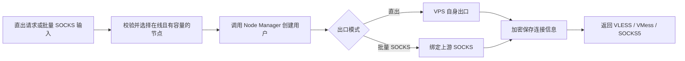

# NiuSu Node Control Plane

Spring Boot + Vue 多节点控制面，用于集中管理 Node Manager VPS，支持 VPS 直出自动开通，也支持批量导入上游 SOCKS 后生成 VLESS、VMess、SOCKS5 节点用户和连接。业务数据和加密连接信息统一保存到 MySQL。

## 核心能力

- Node Manager 安装后自动注册或按 API 地址手动注册
- 节点心跳、在线/降级/离线判定、容量和维护模式
- 按节点容量自动选择在线 VPS，支持指定 Node Manager
- 自动创建 VLESS、VMess、SOCKS5，默认使用 VPS 自身出口
- 批量粘贴上游 SOCKS，支持 5 列和带序号的 6 列格式
- 空格/Tab 分隔，自动清理 WPS/Excel 的 BOM、NBSP 和全角空格
- IP、域名、端口、账号、密码逐行校验，错误行不影响其他有效行
- 生成单行连接、复制单条链接或复制所有链接
- 管理端账号密码登录，使用 HttpOnly、SameSite=Strict Cookie 会话
- 开通请求、远端写操作和重试全链路幂等
- 节点 Token、上游 SOCKS 凭据和生成连接使用 AES-GCM 加密落库
- 自动分配记录、失败重试和 VLESS/VMess/SOCKS5 连接查看
- 所有业务数据持久化到 MySQL

## 自动开通流程



## 项目结构

```text
control-plane/
├─ backend/       Spring Boot 3.4 / Java 21 / JPA
├─ frontend/      Vue 3 / Vite
├─ scripts/       Windows 开发和构建脚本
└─ .env.example   生产配置示例
```

## 数据库准备

建议给控制面单独创建数据库和账号。该账号需要对控制面数据库拥有建表和读写权限，Hibernate 使用 `ddl-auto=update` 创建表。

```sql
CREATE DATABASE `control-plane` CHARACTER SET utf8mb4 COLLATE utf8mb4_unicode_ci;
GRANT ALL PRIVILEGES ON `control-plane`.* TO 'control_plane'@'%';
```

## 配置

复制 `.env.example` 为 `.env.local`。生产环境至少必须设置以下变量：

| 环境变量 | 说明 |
| --- | --- |
| `CONTROL_PLANE_DB_URL` | 控制面 MySQL JDBC 地址 |
| `CONTROL_PLANE_DB_USERNAME` / `CONTROL_PLANE_DB_PASSWORD` | 控制面数据库账号 |
| `CONTROL_PLANE_ENCRYPTION_KEY` | 必填的长随机加密密钥，部署后不可随意更换 |
| `CONTROL_PLANE_LOGIN_USERNAME` | 数据库账号表为空时，用于初始化第一个管理账号 |
| `CONTROL_PLANE_LOGIN_PASSWORD` | 第一个管理账号的初始化密码，入库时只保存 BCrypt 哈希 |
| `CONTROL_PLANE_SESSION_TTL_SECONDS` | 登录会话有效期，默认 `43200` 秒 |
| `CONTROL_PLANE_ADMIN_TOKEN` | 旧 API 客户端兼容用 `X-Control-Token`，管理界面不再保存或使用它 |
| `CONTROL_PLANE_REGISTRATION_TOKEN` | Node Manager 安装脚本专用注册令牌 |
| `NODE_DEFAULT_MAX_USERS` | 新节点默认容量，默认 `500` |

可用 OpenSSL 生成密钥和令牌：

```bash
openssl rand -base64 48
openssl rand -hex 32
```

`CONTROL_PLANE_ENCRYPTION_KEY` 用于解密历史数据。更换它会导致已保存的 Node Manager Token 和连接信息无法读取。

首次部署时，在 `.env.local` 配置第一个管理账号并启动服务：

```dotenv
CONTROL_PLANE_LOGIN_USERNAME=admin
CONTROL_PLANE_LOGIN_PASSWORD=replace-with-a-strong-password
CONTROL_PLANE_SESSION_TTL_SECONDS=43200
```

启动时只有在 `control_users` 表为空的情况下，控制面才使用上述环境变量创建第一个账号。密码使用 BCrypt 哈希入库，不保存环境变量中的明文。数据库已经存在账号后，修改环境变量或重启服务不会覆盖任何账号。

登录后可通过右上角“账号管理”创建其他账号、启用或停用账号、重置密码和删除账号。所有启用账号目前拥有与初始管理员相同的 Control Plane 操作权限。重置密码、停用或删除账号会使该账号已有 Cookie 立即失效；不能停用或删除当前登录账号，系统也始终要求至少保留一个启用账号。生产环境必须通过 HTTPS 暴露管理端。

## 批量 SOCKS 输入

首页“节点信息输入”支持以下两种格式，每行一条，列之间使用空格或 Tab：

```text
198.51.100.10 proxy.example.com 1080 upstream-user upstream-password
2 198.51.100.11 - 1080 upstream-user upstream-password
```

第一种为 `IP 域名 端口 用户名 密码`，第二种为 `序号 IP 域名 端口 用户名 密码`。没有域名时填写 `-`，系统改用 IP 连接上游。单次最多 50 行；错误会按原始行号显示，不阻塞有效行生成。

上游账号密码在提交后从输入框清除，不写入 `localStorage` 或 `sessionStorage`；完整连接默认遮罩，只在当前页面内存中按需显示或复制。关闭页面、退出登录或会话失效后会清除内存结果。

## 本地开发

```powershell
cd frontend
npm.cmd install
npm.cmd run dev
```

```powershell
cd backend
mvn spring-boot:run
```

前端默认访问 `http://localhost:5173`，后端为 `http://localhost:8090`，健康检查为 `/actuator/health`。

## 构建与运行

```powershell
.\scripts\build.ps1
.\scripts\run-jar.ps1
```

构建脚本先生成 Vue 静态资源，再打包到 Spring Boot JAR。生产环境建议以 systemd 运行 JAR，并通过 HTTPS 反向代理暴露控制面。

## Node Manager 自动注册

control-plane 启动并配置注册令牌后，在每台 VPS 执行：

```bash
CONTROL_PLANE_URL="https://control.example.com" \
CONTROL_PLANE_REGISTRATION_TOKEN="registration-secret" \
NODE_MANAGER_PUBLIC_URL="http://VPS_PUBLIC_IP:8088" \
NODE_MANAGER_NAME="us-vps-01" \
NODE_MANAGER_NODE_ID="us-vps-01" \
NODE_MANAGER_MAX_USERS="500" \
CONTROL_PLANE_REGISTRATION_REQUIRED="1" \
bash <(curl -Ls https://raw.githubusercontent.com/52Jerry/Node-Manager/main/install.sh)
```

安装脚本会复用已有 Node Manager API Token 和节点 ID，重装时更新原节点而不会生成重复记录。注册令牌仅通过 `X-Registration-Token` 请求头发送，不会写入信息文件。

## 控制 API

| 接口 | 作用 |
| --- | --- |
| `POST /api/control/agent/register` | 安装脚本注册或更新节点 |
| `GET /api/control/nodes` | 节点列表 |
| `PATCH /api/control/nodes/{id}` | 启用、维护和容量设置 |
| `POST /api/control/auth/login` | 管理账号密码登录并创建 Cookie 会话 |
| `GET /api/control/auth/session` | 查询当前会话状态 |
| `POST /api/control/auth/logout` | 退出并清除 Cookie 会话 |
| `GET /api/control/accounts` | 列出管理账号，不返回密码或密码哈希 |
| `POST /api/control/accounts` | 创建同权限管理账号 |
| `PATCH /api/control/accounts/{id}` | 启用/停用账号或重置密码 |
| `DELETE /api/control/accounts/{id}` | 删除非当前管理账号 |
| `POST /api/control/allocations` | 在可用 VPS 上自动开通直出节点 |
| `POST /api/control/allocations/proxy-provisions` | 批量校验上游 SOCKS 并生成节点用户/连接 |
| `GET /api/control/allocations` | 分配摘要列表，不含连接密钥 |
| `GET /api/control/allocations/{id}` | 获取单条分配和连接密钥 |
| `POST /api/control/allocations/{id}/retry` | 重试待处理或失败分配 |

自动开通必须携带唯一 `Idempotency-Key`。相同键只允许对应完全相同的请求。连接密钥响应使用 `Cache-Control: no-store`，不要写入普通业务日志。

## 验证

```powershell
cd frontend
npm.cmd run build

cd ..\backend
mvn test
```

当前测试覆盖加密存储、节点注册更新、删除保护、节点选择、无代理直出请求、批量 SOCKS 两种格式、表格粘贴清理、逐行错误隔离、结果排序、远端重试、幂等冲突、账号密码会话、旧 Token 兼容、注册鉴权和敏感响应缓存策略。

详细实现、运维和安全边界参见 [账号登录与批量 SOCKS 节点开发文档](doc/账号登录与批量SOCKS节点开发文档.md)，后续演进参见 [后续优化清单](doc/后续优化清单.md)。
