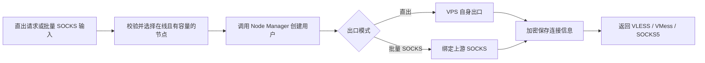

# NiuSu Node Control Plane

Spring Boot + Vue 多节点控制面，用于集中管理 Node Manager VPS，支持 VPS 直出自动开通，也支持批量导入上游 SOCKS 后生成 VLESS、VMess、SOCKS5 节点用户和连接。业务数据和加密连接信息统一保存到 MySQL。

## 核心能力

- Node Manager 安装后自动注册或按 API 地址手动注册
- 控制中心页面生成短时一次性命令，一键安装 Node Manager 并自动注册
- 节点心跳、在线/降级/离线判定、容量和维护模式
- 按节点容量自动选择在线 VPS，支持指定 Node Manager
- 自动创建 VLESS、VMess、SOCKS5，默认使用 VPS 自身出口
- 批量粘贴上游 SOCKS，支持 5 列和带序号的 6 列格式
- 空格/Tab 分隔，自动清理 WPS/Excel 的 BOM、NBSP 和全角空格
- IP、域名、端口、账号、密码逐行校验，错误行不影响其他有效行
- 生成单行连接、复制单条链接或复制所有链接
- 管理端账号密码登录，使用 HttpOnly、SameSite=Strict Cookie 会话
- 开通请求、远端写操作和重试全链路幂等
- 节点 Token、上游 SOCKS 凭据和生成连接使用 AES-GCM 加密落库
- 自动分配记录、失败重试和 VLESS/VMess/SOCKS5 连接查看
- 所有业务数据持久化到 MySQL

## 自动开通流程



## 项目结构

```text
control-plane/
├─ backend/       Spring Boot 3.4 / Java 21 / JPA
├─ frontend/      Vue 3 / Vite
├─ scripts/       Windows 开发和构建脚本
├─ .env.example   生产环境变量示例
└─ .env.local.example  本地环境变量示例
```

## 数据库准备

建议给控制面单独创建数据库和账号。首次部署前请按兼容迁移/后续版本化迁移准备表结构；生产环境使用 `ddl-auto=validate`，不会在启动时自动创建或修改业务表。升级已有数据库时，先执行 [生产结构迁移脚本](doc/production-schema-migration.sql)，再替换应用 JAR。

```sql
CREATE DATABASE `control-plane` CHARACTER SET utf8mb4 COLLATE utf8mb4_unicode_ci;
GRANT ALL PRIVILEGES ON `control-plane`.* TO 'control_plane'@'%';
```

## 配置

生产服务器复制 `.env.example` 为 `/etc/node-control-plane.env`。日常只需要填写下面 7 个值：

```dotenv
SPRING_PROFILES_ACTIVE=prod

CONTROL_PLANE_DB_HOST=数据库地址
CONTROL_PLANE_DB_USERNAME=数据库账号
CONTROL_PLANE_DB_PASSWORD=数据库密码

CONTROL_PLANE_ENCRYPTION_KEY=长随机加密密钥
CONTROL_PLANE_LOGIN_USERNAME=admin
CONTROL_PLANE_LOGIN_PASSWORD=管理员密码
CONTROL_PLANE_REGISTRATION_TOKEN=长随机节点注册令牌
```

通过标准 Nginx/Caddy 反向代理并正确传递 `X-Forwarded-Proto`、`X-Forwarded-Host` 时，页面会自动识别公网地址。多层代理、内网回源或本地 IDEA 连接线上数据库时，建议额外配置：

```dotenv
CONTROL_PLANE_PUBLIC_URL=https://你的控制中心域名
```

默认数据库名为 `control-plane`，端口为 `3306`，Control Plane 监听 `8090`，新节点容量为 `500`，会话有效期为 12 小时。通常不需要再配置这些项目。特殊环境可以使用 `CONTROL_PLANE_DB_PORT`、`CONTROL_PLANE_DB_NAME` 或完整的 `CONTROL_PLANE_DB_URL` 覆盖数据库连接。

可用 OpenSSL 生成密钥和令牌：

```bash
openssl rand -base64 48
openssl rand -hex 32
```

`CONTROL_PLANE_ENCRYPTION_KEY` 用于解密历史数据。更换它会导致已保存的 Node Manager Token 和连接信息无法读取。

Spring 配置按环境拆分：

- `application-prod.yml`：提交到 GitHub，服务器通过 `prod` Profile 使用，文件中不保存真实秘密。
- `application.yml`：本地 IDEA 开发配置，被 Git 忽略且不上传 GitHub；直接运行 `NodeControlApplication` 时自动使用，真实秘密从被 Git 忽略的 `.env.local` 读取。

启动时只有在 `control_users` 表为空的情况下，控制面才使用配置的管理员账号密码创建第一个账号。密码使用 BCrypt 哈希入库。数据库已经存在账号后，修改环境变量或重启服务不会覆盖任何账号。

登录后可通过右上角“账号管理”创建其他账号、启用或停用账号、重置密码和删除账号。所有启用账号目前拥有与初始管理员相同的 Control Plane 操作权限。重置密码、停用或删除账号会使该账号已有 Cookie 立即失效；不能停用或删除当前登录账号，系统也始终要求至少保留一个启用账号。生产环境必须通过 HTTPS 暴露管理端。

## 批量 SOCKS 输入

首页“节点信息输入”支持以下两种格式，每行一条，列之间使用空格或 Tab：

```text
198.51.100.10 proxy.example.com 1080 upstream-user upstream-password
2 198.51.100.11 - 1080 upstream-user upstream-password
```

第一种为 `IP 域名 端口 用户名 密码`，第二种为 `序号 IP 域名 端口 用户名 密码`。没有域名时填写 `-`，系统改用 IP 连接上游。单次最多 50 行；错误会按原始行号显示，不阻塞有效行生成。

上游账号密码在提交后从输入框清除，不写入 `localStorage` 或 `sessionStorage`；完整连接默认遮罩，只在当前页面内存中按需显示或复制。关闭页面、退出登录或会话失效后会清除内存结果。

## 本地开发

### 一键启动本地完整版本

Windows PowerShell 在项目根目录执行：

```powershell
.\start-local.ps1
```

脚本读取 Git 忽略的 `.env.local` 和本地 `application.yml`，连接阿里云 `control-plane` RDS。源码有更新时会自动构建前端和后端，启动后访问 `http://127.0.0.1:8090`。本地配置使用 `ddl-auto=none`，不允许 Hibernate 自动创建、校验或修改生产表；同时关闭自动节点心跳刷新，避免 IDEA 启动后周期性写回线上节点状态。

如果需要强制重新构建：

```powershell
.\start-local.ps1 -Rebuild
```

首次使用前，必须在 `.env.local` 填写阿里云 RDS 密码，并安全复制服务器当前的 `CONTROL_PLANE_ENCRYPTION_KEY`。加密密钥必须与生产完全一致，不能新生成，否则已保存的节点 Token 和连接密文无法解密。登录时直接使用阿里云数据库 `control_users` 表中的启用账号。

注意：本地服务连接的仍是线上阿里云数据库。`ddl-auto=none` 只禁止 Hibernate 自动建表和改表，并跳过启动时的结构校验；关闭自动心跳也只消除后台周期写入。在页面中新增/修改账号、节点、节点用户或执行删除、重试等手动操作，都会直接影响线上数据。若本地代码依赖尚未部署到线上数据库的新字段，对应功能仍会在访问时失败，应先通过生产发布流程完成数据库升级。

在 IDEA 中直接运行 `NodeControlApplication` 即可，不需要设置 Active profiles、Program arguments 或数据库环境变量。本地 `application.yml` 会自动导入根目录中被 Git 忽略的 `.env.local`。Working directory 使用项目根目录或 `backend` 目录均可；日志显示默认 Profile 属于正常现象。

### 前后端热更新开发

```powershell
cd frontend
npm.cmd install
npm.cmd run dev
```

```powershell
./scripts/dev-backend.ps1
```

前端默认访问 `http://localhost:5173`，后端为 `http://localhost:8090`，健康检查为 `/actuator/health`。`dev-backend.ps1` 会读取根目录 `.env.local`，后端自动使用本地 `application.yml`。

## 构建与运行

```powershell
.\scripts\build.ps1
.\scripts\run-jar.ps1
```

构建脚本先生成 Vue 静态资源，再打包到 Spring Boot JAR。生产环境建议以 systemd 运行 JAR，并通过 HTTPS 反向代理暴露控制面。Maven 会显式排除本地 `application.yml`，生产包只携带 `application-prod.yml`；真实配置继续从 `/etc/node-control-plane.env` 注入。

生产服务器的 EnvironmentFile 必须包含：

```dotenv
SPRING_PROFILES_ACTIVE=prod
```

生产启动日志必须显示 `The following 1 profile is active: "prod"`。如果没有激活任何 Profile，应用将不会获得数据库和 Control Plane 配置，不应继续部署。

## Node Manager 自动注册

登录 Control Plane，在“全部节点”区域点击“一键安装 Node Manager”，复制命令到目标 VPS 的 root 终端执行即可。页面命令包含一个默认 10 分钟有效、仅可成功使用一次的安装码；无需查看或输入长期 `CONTROL_PLANE_REGISTRATION_TOKEN`。

```bash
bash <(curl -fsSL 'https://raw.githubusercontent.com/52Jerry/Node-Manager/main/install.sh') 'https://你的控制中心域名' 'niusu_一次性安装码'
```

公网 IP、节点 ID、节点名称、API Token 和默认容量都会自动生成或识别。安装码只在生成响应和当前浏览器内存中出现，数据库保存 SHA-256 摘要；注册成功后立即失效，节点验证失败时允许安装脚本安全重试。安装码不会写入 Node Manager 信息文件、Control Plane 日志或浏览器存储。

安装脚本会复用已有 Node Manager API Token 和节点 ID，重装时更新原节点而不会生成重复记录。请确保 Control Plane 能访问该 VPS 的 TCP `8088` 端口。

长期注册令牌方式仍然兼容。只传 Control Plane 地址时，脚本会在终端隐藏提示输入 `CONTROL_PLANE_REGISTRATION_TOKEN`：

```bash
bash <(curl -Ls https://raw.githubusercontent.com/52Jerry/Node-Manager/main/install.sh) https://你的控制中心域名
```

无人值守安装仍可使用环境变量：

```bash
CONTROL_PLANE_REGISTRATION_TOKEN="节点注册令牌" \
bash <(curl -Ls https://raw.githubusercontent.com/52Jerry/Node-Manager/main/install.sh) https://你的控制中心域名
```

## 控制 API

| 接口 | 作用 |
| --- | --- |
| `POST /api/control/node-installation` | 为当前管理员生成短时一次性安装命令 |
| `POST /api/control/agent/register` | 安装脚本注册或更新节点 |
| `GET /api/control/nodes` | 节点列表 |
| `PATCH /api/control/nodes/{id}` | 启用、维护和容量设置 |
| `POST /api/control/auth/login` | 管理账号密码登录并创建 Cookie 会话 |
| `GET /api/control/auth/session` | 查询当前会话状态 |
| `POST /api/control/auth/logout` | 退出并清除 Cookie 会话 |
| `GET /api/control/accounts` | 列出管理账号，不返回密码或密码哈希 |
| `POST /api/control/accounts` | 创建同权限管理账号 |
| `PATCH /api/control/accounts/{id}` | 启用/停用账号或重置密码 |
| `DELETE /api/control/accounts/{id}` | 删除非当前管理账号 |
| `POST /api/control/allocations` | 在可用 VPS 上自动开通直出节点 |
| `POST /api/control/allocations/proxy-provisions` | 批量校验上游 SOCKS 并生成节点用户/连接 |
| `GET /api/control/allocations` | 分配摘要列表，不含连接密钥 |
| `GET /api/control/allocations/{id}` | 获取单条分配和连接密钥 |
| `POST /api/control/allocations/{id}/retry` | 重试待处理或失败分配 |

自动开通必须携带唯一 `Idempotency-Key`。相同键只允许对应完全相同的请求。连接密钥响应使用 `Cache-Control: no-store`，不要写入普通业务日志。

## 验证

```powershell
cd frontend
npm.cmd run build

cd ..\backend
mvn test
```

当前测试覆盖加密存储、节点注册更新、删除保护、节点选择、无代理直出请求、批量 SOCKS 两种格式、表格粘贴清理、逐行错误隔离、结果排序、远端重试、幂等冲突、账号密码会话、旧 Token 兼容、一次性安装码单次消费/失败释放/过期拒绝、注册鉴权和敏感响应缓存策略。

### 生产数据库升级顺序

1. 在 RDS 控制台或受控客户端完成 `control-plane` 数据库备份，并记录备份时间和恢复点。
2. 确认当前连接库为 `control-plane`；不要在 `niusuip` 或其他业务库执行脚本。
3. 使用最小权限的迁移账号执行 `doc/production-schema-migration.sql`。脚本是幂等的，只补字段并移除旧版本在 `control_user_id` 上的单列全局唯一索引，不删除业务数据。
4. 使用脚本末尾的 `SHOW COLUMNS` 与 `SHOW INDEX` 语句验证三个字段存在，并确认没有误删主键或复合索引。
5. 再部署生产 JAR。生产配置保持 `spring.jpa.hibernate.ddl-auto=validate` 与 `control-plane.schema.compatibility-migration-enabled=false`。
6. 启动后检查 `/actuator/health`、登录、节点列表和一条连接详情。

回滚应优先使用数据库备份恢复；不要通过删除新字段回滚，因为这可能破坏已经写入的协议密文或节点心跳数据。

详细实现、运维和安全边界参见 [账号登录与批量 SOCKS 节点开发文档](doc/账号登录与批量SOCKS节点开发文档.md)，后续演进参见 [后续优化清单](doc/后续优化清单.md)。
